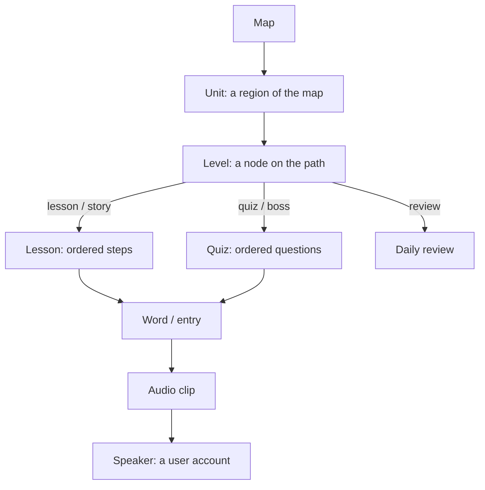

# How Tachawit works

All learning content is **data in the database**, edited from `/admin`. Adding a word, a lesson or a map node never needs code or a redeploy. This page explains the building blocks and how they connect.

## The big picture

A learner walks the **map**, opens a **level**, and learns the **words** inside it by listening to **audio clips** recorded by real **speakers**. What each learner has done is stored separately (see [Learner progress](#learner-progress)), so content and progress never mix.

## The map, units and levels

### Map
The map is the home screen: one winding journey through the Aurès. It is not a table of its own; it is the list of **published units**, in order, each drawn as one region of the journey.

### Unit (`units`)
A chapter of the course, e.g. "First Words & Greetings".

| Field | Meaning |
| --- | --- |
| `title`, `description` | Shown to learners, in each interface language |
| `position` | Order on the map (0 = first) |
| `map_theme` | The scenery drawn behind it: `aures_peaks`, `cedar_forest`, `cliff_villages`, `palm_groves` |
| `cover_image_path` | Optional illustration |
| `status` | `draft` or `published` |

### Level (`levels`)
One node on the path inside a unit. A level doesn't hold content itself: it **points to** a lesson or a quiz.

| Type | Opens | Stars |
| --- | --- | --- |
| `lesson` | a lesson | 3 when finished |
| `story` | a lesson (usually a dialogue) | 3 when finished |
| `quiz` | a quiz | 1–3, based on first-try accuracy |
| `boss` | a quiz (a bigger end-of-unit challenge) | 1–3, based on first-try accuracy |
| `review` | the daily review of words due | 3 when finished |

Other fields:
- **`position`**: order inside the unit.
- **`map_x`, `map_y`**: where the node sits on the unit's map, from 0 to 1. They are set by dragging the node in the admin map editor.
- **`unlock_rule`**: when the level opens.

| Unlock rule | Opens when… |
| --- | --- |
| `previous_completed` (default) | the level before it is completed |
| `always` | immediately |
| `levels_completed` | a chosen list of levels is completed |
| `unit_stars` | the learner has at least N stars in this unit |

Each level shows one of four states: **locked**, **available**, **current** (the first open level not yet done, where the avatar stands) or **completed** (with its stars).

## Words, audio and speakers

### Word (`entries`)
A word or phrase in Tachawit. Everything learners study is built from entries.

| Field | Meaning |
| --- | --- |
| `text_latin` | Required. Stored **exactly as typed**, never corrected or normalized |
| `text_arabic`, `text_tifinagh` | Optional other scripts. When one is missing, the app shows Latin |
| `translations` | Meaning in `en`, `fr`, `ar` |
| `part_of_speech` | noun, verb, phrase, expression… |
| `region_id` | Where this form is used (e.g. Batna, Khenchela) |
| `notes`, `image_path` | Optional |
| `status` | `draft` or `published` |

Dialect variants are separate entries, each with its own region. The app shows the region tag next to them instead of treating them as mistakes.

### Region (`regions`)
The list of places (Batna, Khenchela, Oum El Bouaghi, Tébessa, Biskra…) used to tag words, speakers and contributions.

### Audio clip (`audio_clips`)
A recording of one entry by one speaker.

- **Files**: a web-friendly version for playback, the untouched original (kept privately), and an optional slow version.
- **`word_timestamps`**: optional start and end times for each word. They drive the karaoke-style highlighting and let learners tap a single word to hear it.
- **`is_primary`**: the clip played by default when an entry has several.
- **`status`**: a clip can only be published if its speaker has given consent.

### Speaker (`speakers`)
A person who lends their voice. **A speaker is always a user account**: the speaker id is the user id.
- Any user can become a speaker, from their profile or when sending a recording on the Contribute page.
- Speakers manage their own display name, region, village, bio and **consent**. The consent date is recorded automatically.
- Admins can't create or assign speakers. A clip is credited to whoever recorded it: an admin adding audio is credited as the speaker (so they set up their own voice first), and an approved contribution is credited to the person who sent it.
- If a speaker withdraws consent, all their published clips go back to draft automatically.

## Lessons and quizzes

Lessons and quizzes are an ordered list of steps or questions, stored as JSON and checked with Zod (`src/lib/content/lesson.ts`, `src/lib/content/quiz.ts`). They **reference entries by id**, so fixing a word fixes it everywhere it's used.

### Lesson (`lessons`): step types

| Step | What the learner does |
| --- | --- |
| `introduce` | Meets a new word: audio, text, meaning, image |
| `listen_repeat` | Listens to a word and says it aloud |
| `dialogue` | Follows a short conversation between speakers, line by line (at least 2 lines) |
| `culture_note` | Reads a short cultural note, either linked from the Culture section or written in the step |

### Quiz (`quizzes`): question types

| Question | What the learner does |
| --- | --- |
| `listen_pick_translation` | Hears a word and picks its meaning |
| `pick_audio` | Reads a meaning and picks the right recording |
| `build_sentence` | Hears a phrase and rebuilds it from word tiles |
| `match_pairs` | Matches 2–6 recordings to their meanings |
| `fill_blank` | Picks the missing word in a phrase |
| `speak` | Records themselves and compares by listening back (not scored) |

Wrong answers (the "distractors") are other entries, chosen in the builder. There are no hearts or lives: a missed question comes back at the end of the quiz.

## Learner progress

Progress belongs to each learner and is private to them (admins can read it for stats).

| Table | Holds |
| --- | --- |
| `level_progress` | Per level: best stars (0–3), attempts, when it was completed |
| `learner_stats` | Total XP, current and longest streak, last active day |
| `srs_items` | Per word: when to review it next (spaced repetition) |

**XP** (`src/lib/progress/xp.ts`): a finished lesson gives 10 XP. A quiz gives 10 XP plus 2 XP per question right on the first try. A review gives 2 XP per word.

**Streak**: one more day for each consecutive day with activity. It restarts at 1 after a missed day.

**Spaced-repetition review** (`src/lib/srs/sm2.ts`): every word finished in a lesson or quiz is scheduled for review the next day. A right answer pushes the next review further out (1 day, then 6 days, then longer); a miss brings it back to tomorrow. The daily review builds a quiz from the words that are due.

**Guest mode**: without an account, progress is saved in the browser. When the learner signs up, it's merged into their account.

## Other content

| What | Table | Where it shows |
| --- | --- | --- |
| Culture articles (music, jewelry, history, Yennayer, food, crafts…) | `culture_notes` | Culture section; can be linked to a unit or a lesson step |
| Outside resources (links to channels, pages, sites) | `resources` | Resources page |
| Public contributions | `submissions` | Admin review queue (never shown to learners directly) |

A **submission** is a recording sent from the Contribute page. Speakers sign in, set up their voice once (name, region, village and consent), then record word after word. The page asks for words that still have no audio (by meaning only, so each speaker says it their own way); speakers can also record a word of their choice. Writing what they said is optional, in the scripts they choose. An admin listens, edits, then approves (the clip is attached to the word, credited to the speaker) or rejects. Older submissions may also be words, variants or corrections, from before the page only took recordings.

## Draft, publish and who can do what

Every piece of content has a **status**: `draft` or `published`. Learners only ever see published content. The database enforces this, not just the interface:

- A lesson or quiz **can't be published** while it uses a word that is still a draft.
- A word **can't be unpublished** while a published lesson or quiz uses it.
- An audio clip **can't be published** without the speaker's consent.
- A published level must point to a lesson or quiz (except `review` levels).

Access is controlled by Row Level Security on every table:

| Who | Can |
| --- | --- |
| Visitor (not signed in) | Read published content |
| Learner (signed in) | The above, plus save their own progress, send recordings, manage their own speaker profile |
| Admin (`profiles.role = 'admin'`) | Create, edit and publish all content; review submissions; read learner stats |

Files are kept in Supabase Storage: `audio` (public playback files), `audio-originals` (private originals), `images`, and `submissions` (recordings waiting for review).

## Example: adding a new lesson

1. **Words**: in Admin → Entries, create each word (Latin text, other scripts if known, meanings, region). Or import them from a CSV.
2. **Audio**: record each word in your own voice (or approve recordings sent from the Contribute page), trim it, and optionally place word cuts for highlighting.
3. **Lesson**: in the lesson builder, add steps (introduce, listen and repeat, dialogue…) and pick the words. Check the preview.
4. **Map**: in the map editor, add a `lesson` level to a unit, link the lesson and drag the node into place.
5. **Publish**: publish the words, audio, lesson and level. The admin shows what is still hiding content from learners, and can publish it all in one go.
